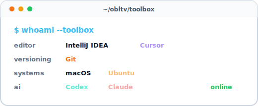
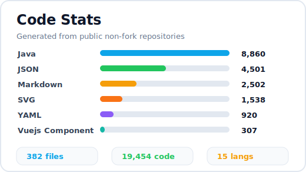

 
 

### 🪬 About Me

> 富婆姐姐必杀榜榜首

- 持续学习后端开发与架构知识
- 关注系统设计、工程实践与代码质量
- 沉醉于前沿 AI 工具的使用与探索
- Apple 生态重度依赖者，Codex 与 Cursor 成瘾者

 

### 🧩 Tech Stack

#### 后端

#### 前端

#### 中间件

#### 开发工具

 
 

### 📟 Code Stats

